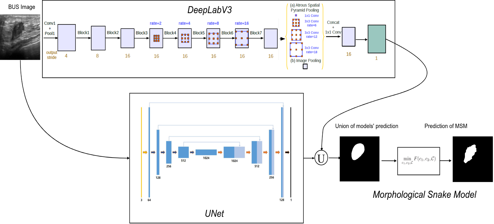
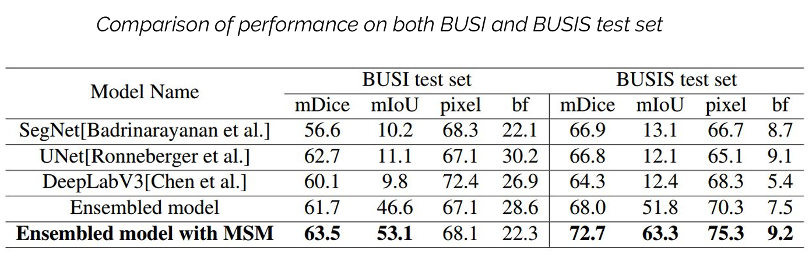
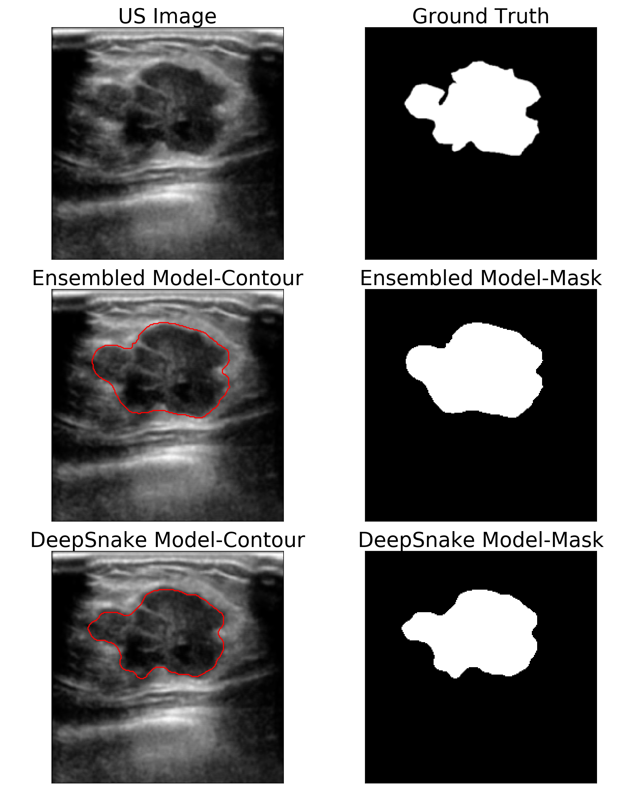
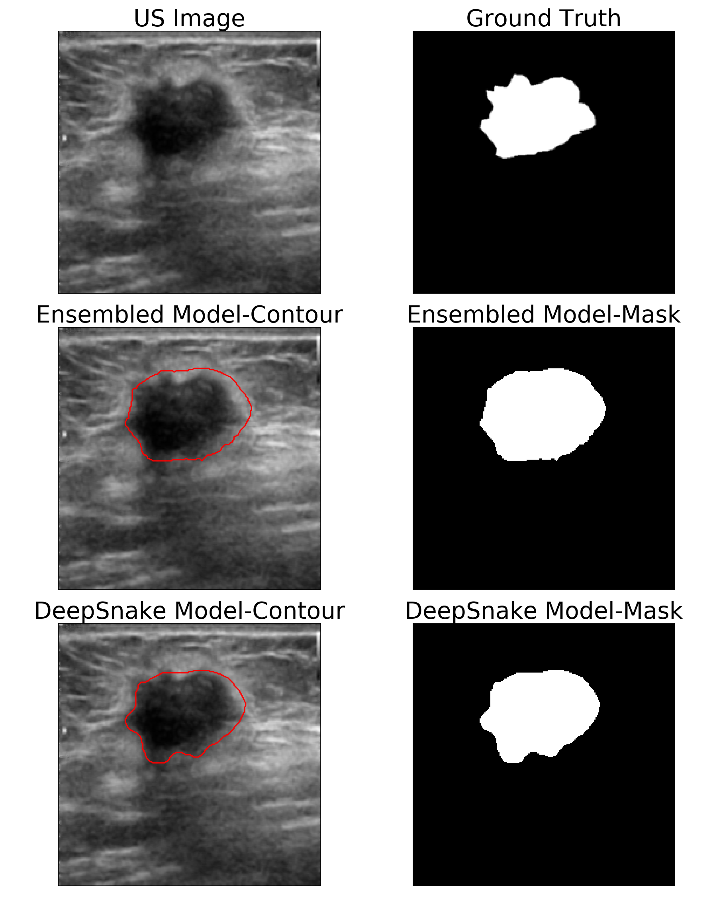

#  DeepSnake: A Deep Convolutional-Snake Model Combination for Breast Ultrasound Image Segmentation

Welcome to the GitHub repository for my thesis work on Breast Ultrasound Image Segmentation. This repository contains the code, datasets, and my full thesis document as a book.

## Table of Contents

1. [Overview](#overview)
2. [Installation](#installation)
3. [Dataset](#dataset)
4. [Usage](#usage)
5. [Visualizing Results](#visualizing-results)
6. [Thesis](#thesis)
7. [Contributing](#contributing)
8. [License](#license)

--------------------------------------------------------------------------------

## Overview

This research aims to improve the accuracy of Breast Ultrasound Image Segmentation. Contour models were one of first methods used in medical image segmentation. It was first introduced by Kass et al. [1]. It uses a method to minimize the energy function from an external and internal force. But the problem with former active contour models is that they are image gradient dependent and strongly depend on initialization. That is why first we employ cnn-based models(ensembled baseline) to locate and roughly segment the hot-portion. CNN-based model are good at localization but they lack spatial resolution and shape information in there prediction. So this output from cnn-model is then fed into morphological snake model for better contour shaped segmentation. This erases active contour model's initialization and localization problem, also exports a high spatial information based and fine boundary-wise prediction. Our experiments show that this leads to a highly effective architecture that produces sharper predictions around object boundaries and significantly boosts performance on thinner and smaller objects. Also this retrieves more spatial resolution than the baseline models. Our method achieves state-of-the-art performance on the BUSI and BUSIS benchmark, in terms of mask quality (mIoU), improving by _6%_ and _11%_ over strong baselines.

[1]: https://www.cs.ait.ac.th/~mdailey/cvreadings/Kass-Snakes.pdf "Snakes: Active contour models"


--------------------------------------------------------------------------------

## Installation

To get started, please clone this repository and set up the required environment by following these instructions.

### Prerequisites

- Python 3.8+
- copy, argparse, glob, configparser, torch, torchvision
- Python IDE

### Setting Up

1. Clone the repository:<br>
  ```bash
  git clone https://github.com/SadiMohammad/dsprl-deepsnake.git
  ```
  ```bash
  cd codes
  ```

--------------------------------------------------------------------------------

## Dataset

All of our experiments are conducted on the BUSI [2] and BUSIS [3] dataset. 

### Training Protocols

We used BUSI dataset’s 95% data as training set and 5% for testing. Of this 95% training set, 15% were used for validation. We further examine our approach by testing it on BUSIS dataset. Hyper-parameter’s were - 

- training images were cropped to 224x224.
- learning rate was varied between 10<sup>-3</sup> to 10<sup>-6</sup>.
- weighted bce-dice loss was used during training process.
- Image pre-processing like brightness-contrast adjustment was used, but they did not make any difference as cnn-based model are mostly invariant to them. Also 2d Cepstrum was used for pre-processing. But it did not make any improvement.

[2]: https://www.sciencedirect.com/science/article/pii/S2352340919312181 "Dataset of breast ultrasound images"
[3]: https://pmc.ncbi.nlm.nih.gov/articles/PMC9025635/ "BUSIS: A Benchmark for Breast Ultrasound Image Segmentation"

--------------------------------------------------------------------------------

## Usage

This section provides examples on how to run the experiments and reproduce the results discussed in the thesis.

### Training the Model

To train the model, run the following command. Model configurations such as batch size, learning rate, paths, number of epochs etc can be modified in config.ini.

```bash
python train.py --config_filename <config filename with path> --config_scheme <section from config file>
```
  e.g. 
```bash
python train.py --config_filename config.ini --config_scheme DEFAULT
```

Training logs, including loss and metrics results, are saved in logs/.

### Evaluating Performance

```bash
python infer.py --config_filename <config filename with path> --config_scheme <section from config file>
```
  e.g. 
```bash
python infer.py --config_filename config.ini --config_scheme TEST
```

#### Evaluating Performance with MorphSnake

Once training is complete, you can evaluate the model's performance on the test set. Trained model's weight can be added in config.ini. Run the evaluation script:

```bash
python inferWithMS.py --config_filename <config filename with path> --config_scheme <section from config file>
```
  e.g. 
```bash
python inferWithMS.py --config_filename config.ini --config_scheme TEST
```

--------------------------------------------------------------------------------

## Visualizing Results

Running `infer.py` or `inferWithMS.py` saves samples output of the models in `./infer/<model_name>`<br>
There is also an option for viewing the baseline modellearning over epochs by running `./codes/visualization.py`

In the following table, we compare the performance of our proposed DeepSnake against the baselines in terms of mIoU, mDice, pixel accuracy and Boundary F1 score.


### Example Visualization

<p float="left">
  
  
</p>

--------------------------------------------------------------------------------

## Thesis

The full thesis is available in PDF format for reference. You can find it in the `./docs` directory.

- Thesis_Book.pdf: A comprehensive document covering the theory, methodology, experiments, and conclusions drawn from this research.
- Thesis_Presentation.pdf: Thesis Presentation Slides.

--------------------------------------------------------------------------------

## Contributing

If you'd like to contribute to this project, please follow these steps:

1. Fork the repository.
2. Create a new branch for your feature (git checkout -b feature-name).
3. Commit your changes (git commit -m 'Add feature').
4. Push to the branch (git push origin feature-name).
5. Open a Pull Request.

-------------------------------------------------------------------------------


## License

This project is licensed under the MIT License - see the <span style="color:blue">LICENSE</span> file for details.
